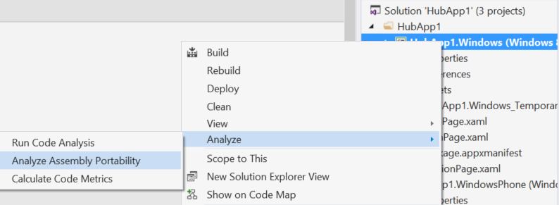

Making your libraries compatible with .NET Core and other .NET Platforms
========================================================================

# [.NET Editions overview](getting-started/overview.md)
# [.NET Primer](getting-started/primer.md)

Want to make your libraries multi-platform? Want to see how much work is
required to make your application compatible with other .NET platforms?
The [.NET Portability
Analyzer](https://visualstudiogallery.msdn.microsoft.com/1177943e-cfb7-4822-a8a6-e56c7905292b)
is a tool that provides you with a detailed report on how flexible your
program is across .NET platforms by analyzing assemblies. The
Portability Analyzer is offered as a Visual Studio Extension and as a
console app.

New Targets
-----------

-   [.NET Core 5](https://www.dotnetfoundation.org/netcore5): Has a
    modular design, employs side-by-side, and targets
    cross-platform scenarios. Side-by-side allows you to adopt new .NET
    Core versions without breaking other apps.
-   [ASP.NET 5](https://www.dotnetfoundation.org/aspnet-5): is a modern
    web-framework built on .NET Core 5 thus giving developers the
    same benefits.
-   [.NET
    Native](http://blogs.msdn.com/b/dotnet/archive/2014/04/24/dotnetnative-performance.aspx):
    Improve performance of your Windows Store apps that run on x64 and
    ARM machines by using .NET Native's static compilation.

How to Use Portability Analyzer
-------------------------------

To begin using the .NET Portability Analyzer, download the extension
from the Visual Studio Gallery. You can configure it in Visual Studio
via *Tools* &gt;&gt; *Options* &gt;&gt; *.NET Portability Analyzer* and
select your Target Platforms. For now, please use ASP.NET 5 as a proxy
for all .NET Core 5-based platforms (e.g. [Windows 10 .NET UAP
apps](http://blogs.windows.com/buildingapps/2015/03/02/a-first-look-at-the-windows-10-universal-app-platform/)).

To analyze your entire project, right-click on your project in the
Solution Explorer and select *Analyze* &gt;&gt; *Analyze Assembly
Portability*. Otherwise, go to the Analyze menu and select *Analyze
Assembly Portability*. From there, select your project's executable or
.dll.

After running the analysis, you will see your .NET Portability Report.
Only types that are unsupported by a target platform will appear in the
list and you can review recommendations in the **Messages** tab in the
**Error List**. You can also jump to problem areas directly from the
**Messages** tab.

Don't want to use Visual Studio? You can also use the Portability
Analyzer from the Command Prompt. Download the command-line analyzer
[here](http://www.microsoft.com/en-us/download/details.aspx?id=42678).

-   Type the following command to analyze the current directory:
    `\...\ApiPort.exe .`
-   To analyze a specific list of .dlls type the following command:
    `\...\ApiPort.exe first.dll second.dll third.dll`

Your .NET Portability Report will be saved as an Excel .xlsx file in
your current directory. The **Details** tab in the Excel Workbook will
contain more info.

For more info on the .NET Portability Analyzer, read [this
article](http://blogs.msdn.com/b/dotnet/archive/2014/08/06/leveraging-existing-code-across-net-platforms.aspx).
